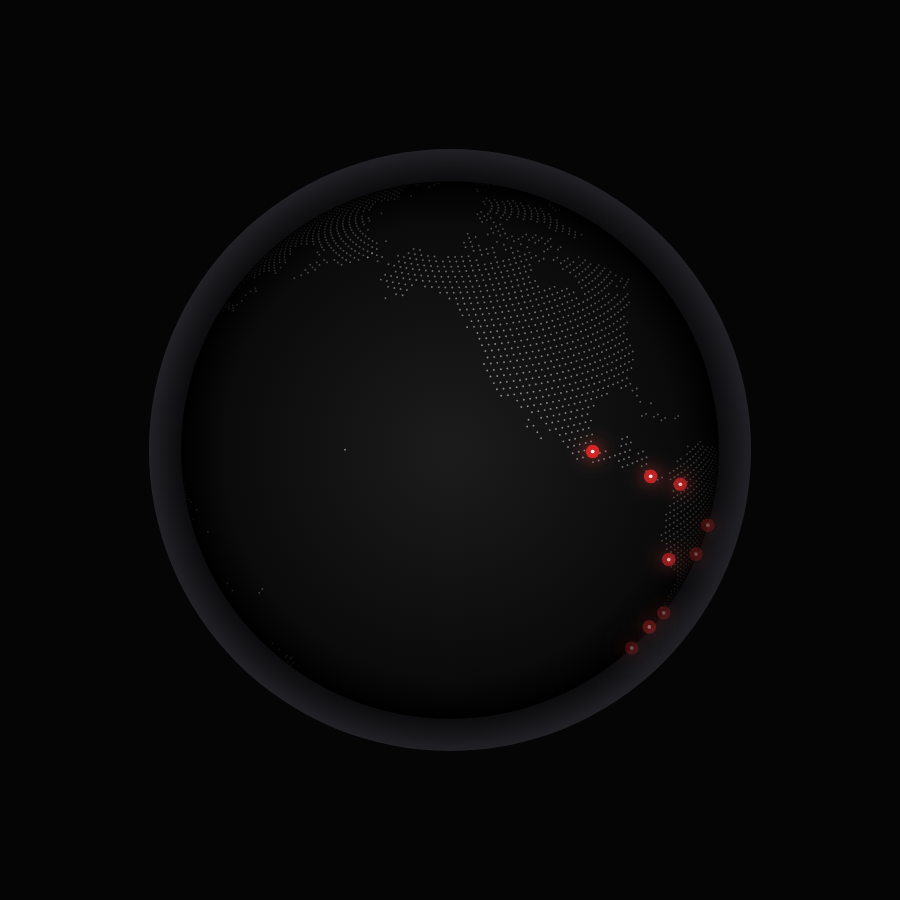
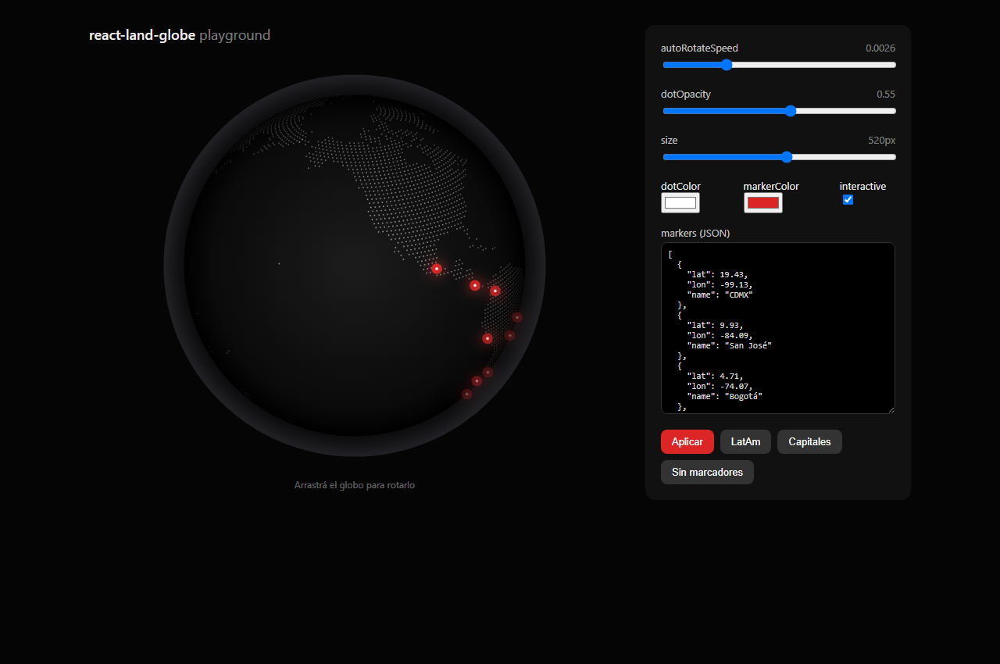

# react-land-globe

[](https://www.npmjs.com/package/react-land-globe)
[](./LICENSE)
[](./src/index.d.ts)

An interactive **canvas globe** for React: dotted continents (5,617 precomputed land points from Natural Earth), smooth auto-rotation, glowing markers, and horizontal drag with mouse & touch.



- **Zero dependencies** — only `react` as a peer dependency
- **No build step** — plain ESM, works out of the box with Vite, Next.js, Astro and CRA
- **SSR-safe** — nothing touches the DOM until `useEffect` (safe for Next.js and Astro islands)
- **Lightweight** — ~46 KB tarball, no map libraries, no WebGL, 60 fps on a plain `<canvas>`
- **TypeScript types included**

## Installation

```bash
npm install react-land-globe
```

## Quick start

```jsx
import LandGlobe from "react-land-globe";

export default function App() {
  return <LandGlobe />;
}
```

With your own markers:

```jsx
<LandGlobe
  markers={[
    { lat: -34.6, lon: -58.38, name: "Buenos Aires" },
    { lat: 40.71, lon: -74.0, name: "New York" },
    { lat: 48.85, lon: 2.35, name: "Paris", color: "59, 130, 246", size: 8 },
  ]}
  autoRotateSpeed={0.002}
  markerColor="227, 25, 55"
/>
```

## Framework guides

### Next.js (App Router)

It's a client component — add the directive in your file:

```jsx
"use client";

import LandGlobe from "react-land-globe";

export default function Hero() {
  return <LandGlobe />;
}
```

### Astro

Works as a React island. `client:visible` defers hydration until it scrolls into view:

```astro
---
import LandGlobe from "react-land-globe";
---

<LandGlobe client:visible />
```

### Vite / CRA

Nothing special needed — import and render.

## API

### Props

| Prop | Type | Default | Description |
| --- | --- | --- | --- |
| `markers` | `GlobeMarker[]` | 9 Latin American cities | Points to draw on the globe |
| `size` | `number` | `520` | Max width of the container in px (the globe is always square) |
| `autoRotateSpeed` | `number` | `0.0026` | Auto-rotation speed in radians per frame. `0` disables it |
| `dragSpeed` | `number` | `0.005` | Drag sensitivity |
| `interactive` | `boolean` | `true` | Enable mouse/touch drag |
| `initialRotation` | `{ x, y }` | `{ x: 0.41, y: -0.9 }` | Initial rotation (the default centers the Americas) |
| `dotColor` | `string` | `"255, 255, 255"` | Land dot color as an `"r, g, b"` triplet |
| `dotOpacity` | `number` | `0.55` | Max opacity of land dots |
| `markerColor` | `string` | `"220, 38, 38"` | Marker color as an `"r, g, b"` triplet |
| `markerGlowColor` | `string` | `"239, 68, 68"` | Marker glow color |
| `markerCoreColor` | `string` | `"255, 255, 255"` | Marker center dot color |
| `backgroundStops` | `[number, string][]` | grey → black gradient | Radial gradient stops: `[position 0-1, CSS color]` |
| `showAtmosphere` | `boolean` | `true` | Draw the atmosphere halo around the globe |
| `maxPixelRatio` | `number` | — | Cap `devicePixelRatio` to save GPU |
| `className` / `style` | — | — | Applied to the wrapper element |

### `GlobeMarker`

```ts
interface GlobeMarker {
  lat: number;        // -90 to 90
  lon: number;        // -180 to 180
  name?: string;      // optional label (informational, not rendered)
  color?: string;     // overrides markerColor for this marker
  glowColor?: string; // overrides markerGlowColor for this marker
  size?: number;      // marker radius in CSS px (default: 6.8)
}
```

> Colors are passed as `"r, g, b"` triplets (not hex) because the component
> combines them with different opacity levels based on each point's depth.

### TypeScript

Types ship with the package — no `@types/*` needed:

```tsx
import LandGlobe, { type GlobeMarker } from "react-land-globe";

const markers: GlobeMarker[] = [{ lat: 0, lon: 0, name: "Null Island" }];
```

## How it works

The globe projects ~5,600 precomputed `(lat, lon)` land points onto a 3D sphere
with two rotations (`x` tilt and `y` spin), discards the back hemisphere, and
modulates each dot's opacity by its depth (`z`) to fake volume. Land points are
generated at build time from [Natural Earth](https://www.naturalearthdata.com/)
110m TopoJSON, so runtime cost is just canvas drawing — no geometry math on the
client, no hydration spike.

## Playground

A live playground with controls for every prop ships with the repo:

```bash
git clone <this-repo>
cd react-land-globe
npm install
npm run dev        # → http://localhost:4310
```



Sliders for speed/opacity/size, color pickers, and a JSON editor for markers
(with validation and presets). Rebuilds automatically on save.

## Tests

```bash
npm test             # unit + component + SSR (Vitest + Testing Library)
npm run test:e2e     # real browser: drag, markers editor (Playwright)
npm run test:package # package validation (publint + arethetypeswrong)
npm run test:all     # everything above
```

| Suite | What it covers |
| --- | --- |
| `test/project.test.js` | Spherical projection math (visible hemisphere, rotations, invariants) |
| `test/component.test.jsx` | Component in jsdom with a mocked 2D context: render loop, colors, `maxPixelRatio`, drag, unmount cleanup |
| `test/ssr.test.jsx` | `renderToString` output + land data validity |
| `test/e2e/run.mjs` | Self-contained Playwright run (build + ephemeral server + Chromium): load, real drag rotation, markers JSON editor |

## Regenerating the land dots

Land points come from `data/land-110m.json` (Natural Earth 110m TopoJSON). If
you swap the dataset or want a different sampling density:

```bash
npm run generate-land-dots
```

This rewrites `src/land-dots.js`. The sampling step is adjustable in
`scripts/generate-land-dots.mjs`.

## Contributing

Issues and PRs are welcome. Please run `npm run test:all` before submitting.

## License

MIT — see [LICENSE](./LICENSE).

Land data: [Natural Earth](https://www.naturalearthdata.com/) (public domain).
